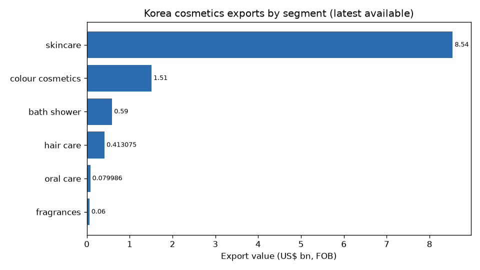
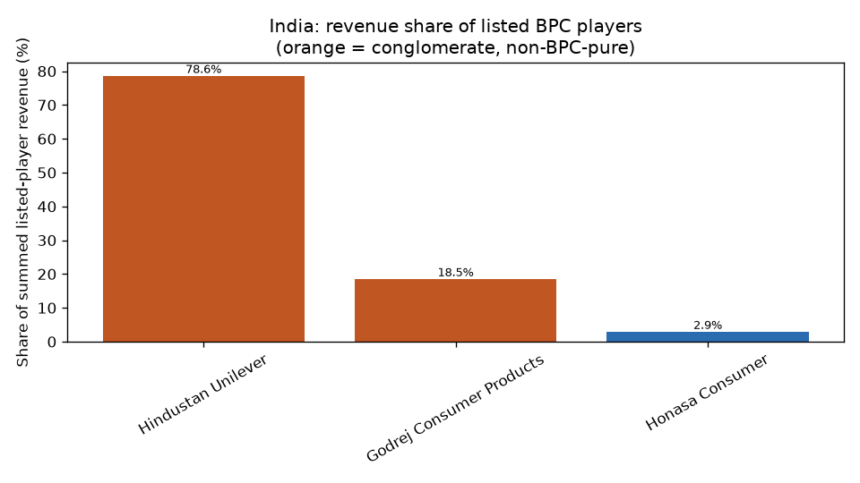
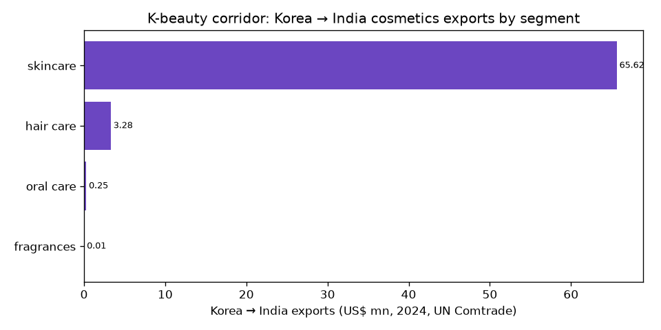

# BPC Market Intelligence Snapshot — South Korea × India
*Generated 2026-07-24 · every figure traces to data/sources.csv · basis and confidence shown inline*

---

## 1. Headline

| | South Korea | India |
|---|---|---|
| Total BPC market size | 13.0 usd_bn (RETAIL, 2024, HIGH; Euromonitor International) | 33.08 usd_bn (RETAIL, 2025, MEDIUM; Statista (via China Briefing)) |
| YoY growth | 1.8 percent (RETAIL, 2024, HIGH; Euromonitor International) | 10.0 percent (RETAIL, 2024, LOW; Baseline consensus (multiple houses)) |
| Forecast CAGR | 6.61 percent (RETAIL, 2025-2030, LOW; Mordor Intelligence) | 3.48 percent (RETAIL, 2025-2030, MEDIUM; Statista) |
| Per-capita spend | 250.0 usd (RETAIL, 2024, ESTIMATE; Baseline report (derived)) | 22.74 usd (RETAIL, 2025, MEDIUM; Statista) |
| Total exports (FOB) | 11.43 usd_bn (EXPORT_FOB, 2025, HIGH; MFDS / Korea Customs Service) | — |

> **Value-basis reminder:** Korea's domestic retail, export FOB, and production value are three different measures — never summed. India retail is MRP-inclusive; company revenue is net realisation.

---

## 2. South Korea — segments

| Segment | Market size | YoY | Fcst CAGR | Exports (FOB) |
|---|---|---|---|---|
| skincare | 7.653 krw_tn (RETAIL, 2025, HIGH; Euromonitor International (via marketresearch.com)) | 1.0 percent (RETAIL, 2025, HIGH; Euromonitor International (via marketresearch.com)) | — | 8.54 usd_bn (EXPORT_FOB, 2025, HIGH; MFDS via Yonhap/Korea Herald) |
| colour cosmetics | — | 12.0 percent (EXPORT_FOB, 2025, HIGH; MFDS via Yonhap/Korea Herald) | — | 1.51 usd_bn (EXPORT_FOB, 2025, HIGH; MFDS via Yonhap/Korea Herald) |
| fragrances | — | — | — | 0.06 usd_bn (EXPORT_FOB, 2025, HIGH; MFDS via Yonhap/Korea Herald) |
| bath shower | — | — | — | 0.59 usd_bn (EXPORT_FOB, 2025, HIGH; MFDS via Yonhap/Korea Herald) |
| dermocosmetics | — | 13.0 percent (RETAIL, 2024, HIGH; Euromonitor International) | — | — |
### Korea — listed-player revenue shares
Shares of summed revenue for 2 listed BRAND OWNERS (KRW krw_tn, NET_REALISATION). Does NOT include unorganised/unlisted players. Conglomerate members (HUL/Godrej/LG H&H) carry non-BPC revenue, so their shares overstate BPC position. Excluded as different value-chain levels (not brand shares): CJ Olive Young (retailer), Cosmax (odm), Kolmar Korea (odm). Excluded (different currency/unit): Innisfree.

| Company | Revenue | Share |
|---|---|---|
| LG H&H | 6.355 krw_tn | 59.9% |
| AmorePacific | 4.253 krw_tn | 40.1% |
---

## 3. India — segments

| Segment | Market size | YoY | Fcst CAGR |
|---|---|---|---|
| skincare | 9.06 usd_bn (RETAIL, 2025, LOW; IMARC Group) | — | — |
| sun care | 0.5766 usd_bn (RETAIL, 2025, LOW; IMARC Group) | 170.0 percent (RETAIL, 2026, LOW; 1digitalstack / quick-commerce report) | 6.8 percent (RETAIL, 2024-2030, LOW; TechSci Research) |
| colour cosmetics | 3.46 usd_bn (RETAIL, 2024, LOW; DMI) | — | — |
| fragrances | 2.6 usd_bn (RETAIL, 2024, LOW; Industry (FMCG analysis via LinkedIn)) | — | — |
| hair care | 4.1 usd_bn (RETAIL, 2026, LOW; Mordor Intelligence) | — | 4.73 percent (NA, 2026-2031, LOW; Mordor Intelligence) |
| mens grooming | 186.3 inr_bn (RETAIL, 2025, HIGH; Euromonitor International) | 9.0 percent (RETAIL, 2025, HIGH; Euromonitor International) | 12.2 percent (RETAIL, 2025-2035, LOW; Future Market Insights) |
| dermocosmetics | 0.2803 usd_bn (RETAIL, 2024, LOW; P&S Market Research) | — | — |
### India — sizing reconciliation (top-down vs bottom-up)
- **Top-down:** 33.08 usd_bn (RETAIL, Statista (via China Briefing))- **Bottom-up:** 82038.0 inr_cr from Honasa Consumer, Hindustan Unilever, Godrej Consumer Products- **Gap:** not computed (bases not comparable) · **Publishable:** False
  - Unit/currency differ (top-down USD usd_bn vs bottom-up INR inr_cr) - convert before comparing.
  - Value basis differs (top-down RETAIL vs bottom-up NET_REALISATION). India RETAIL vs NET_REALISATION differ by the MRP trade margin (lib/transforms/mrp_normalise.py).
  - Bottom-up base is inflated by non-pure-play conglomerates (Godrej Consumer Products, Hindustan Unilever) reporting non-BPC revenue.
### India — listed-player revenue shares
Shares of summed revenue for 3 listed BRAND OWNERS (INR inr_cr, NET_REALISATION). Does NOT include unorganised/unlisted players. Conglomerate members (HUL/Godrej/LG H&H) carry non-BPC revenue, so their shares overstate BPC position. Excluded as different value-chain levels (not brand shares): Nykaa (FSN E-Commerce) (retailer).

| Company | Revenue | Share |
|---|---|---|
| Hindustan Unilever | 64468.0 inr_cr | 78.6% |
| Godrej Consumer Products | 15178.0 inr_cr | 18.5% |
| Honasa Consumer | 2392.0 inr_cr | 2.9% |
---

## 4. K-beauty corridor (Korea → India)

**Trade base:** ~US$50m (H1 2025 basis), +44.7% YoY — small base, fast growth
**Entry barrier:** CDSCO import registration (Form COS-1 -> COS-2 via SUGAM portal) — pre-clearance before any consignment; key friction and lead-time cost

### Corridor sizing (K-beauty in India)
| Segment | Value | Period | Basis | Confidence | Source |
|---|---|---|---|---|---|
| skincare | 0.14006 usd_bn | 2024 | IMPORT_CIF | HIGH | UN Comtrade |
| fragrances | 0.000135 usd_bn | 2024 | IMPORT_CIF | HIGH | UN Comtrade |
| oral_care | 0.000485 usd_bn | 2024 | IMPORT_CIF | HIGH | UN Comtrade |
| total_bpc | 0.4 usd_bn | 2024 | RETAIL | MEDIUM | Economic Times Retail (consulting estimate) |
| total_bpc | 0.002055 usd_bn | 2024 | IMPORT_CIF | HIGH | UN Comtrade |
| total_bpc | 25.9 percent | 2024-2030 | RETAIL | MEDIUM | Economic Times Retail (consulting estimate) |
| total_bpc | 3139.31 inr_cr | 2025 | RETAIL | LOW | Expert Market Research |
| total_bpc | 0.335 usd_bn | 2026 | RETAIL | LOW | The Report Cubes |
| total_bpc | 26.3 percent | 2026-2035 | RETAIL | LOW | Expert Market Research |
| total_bpc | 1.5 usd_bn | 2030 | RETAIL | MEDIUM | Economic Times Retail (consulting estimate) |
| total_bpc | 32424.0 inr_cr | 2035 | RETAIL | LOW | Expert Market Research |
### Corridor trade flows (Korea → India, UN Comtrade)
| Segment | Exports | Period | Source |
|---|---|---|---|
| skincare | 0.065624 usd_bn | 2024 | UN Comtrade |
| hair_care | 0.003277 usd_bn | 2024 | UN Comtrade |
| total_bpc | 0.002497 usd_bn | 2024 | UN Comtrade |
| oral_care | 0.000251 usd_bn | 2024 | UN Comtrade |
| fragrances | 6e-06 usd_bn | 2024 | UN Comtrade |
### Conduits
- **Nykaa** (platform) — Innisfree, Laneige, Sulwhasoo, COSRX, Aestura, Illiyoon, Mise En Scène, RYO, TirTir, Medicube- **Tira (Reliance)** (platform) — Mixsoon, Hince, Medicube, Dr. Melaxin- **Flipkart** (platform) — The Face Shop, TirTir, Beauty of Joseon, rom&nd, Thank You Farmer, K Glo, Soyaang, K Riot- **Amazon India** (platform) — Anua, Some By Mi, Etude, Isntree, Dr.Jart+, The Face Shop- **q-commerce (Blinkit/Zepto/Instamart)** (channel)### Whitespace (ranked)
1. Mid-price derma K-beauty in Tier 2/3 (baseline whitespace #5, highest corridor conviction)
2. Dedicated sunscreens (baseline whitespace #2 — India sun care underpenetrated)
3. Men's K-beauty (baseline whitespace #4 — men's skincare underserved vs toiletries)
---

## 5. Charts

---

## 6. Gaps register (appendix)

# Gaps Register

56 missing segment × geography × metric combinations.

| Geography | Segment | Metric | Status | Suggested source |
|---|---|---|---|---|
| KR | skincare | cagr_forecast | segment has ['export_value', 'growth_yoy', 'market_size'] only | euromonitor_passport, bmi_research, statista |
| KR | sun_care | market_size | no data | euromonitor_passport, statista, tavily |
| KR | sun_care | growth_yoy | no data | euromonitor_passport, korea_mfds, tavily |
| KR | sun_care | cagr_forecast | no data | euromonitor_passport, bmi_research, statista |
| KR | colour_cosmetics | market_size | segment has ['export_value', 'growth_yoy'] only | euromonitor_passport, statista, tavily |
| KR | colour_cosmetics | cagr_forecast | segment has ['export_value', 'growth_yoy'] only | euromonitor_passport, bmi_research, statista |
| KR | fragrances | market_size | segment has ['export_value'] only | euromonitor_passport, statista, tavily |
| KR | fragrances | growth_yoy | segment has ['export_value'] only | euromonitor_passport, korea_mfds, tavily |
| KR | fragrances | cagr_forecast | segment has ['export_value'] only | euromonitor_passport, bmi_research, statista |
| KR | hair_care | market_size | segment has ['export_value'] only | euromonitor_passport, statista, tavily |
| KR | hair_care | growth_yoy | segment has ['export_value'] only | euromonitor_passport, korea_mfds, tavily |
| KR | hair_care | cagr_forecast | segment has ['export_value'] only | euromonitor_passport, bmi_research, statista |
| KR | bath_shower | market_size | segment has ['export_value'] only | euromonitor_passport, statista, tavily |
| KR | bath_shower | growth_yoy | segment has ['export_value'] only | euromonitor_passport, korea_mfds, tavily |
| KR | bath_shower | cagr_forecast | segment has ['export_value'] only | euromonitor_passport, bmi_research, statista |
| KR | deodorants | market_size | no data | euromonitor_passport, statista, tavily |
| KR | deodorants | growth_yoy | no data | euromonitor_passport, korea_mfds, tavily |
| KR | deodorants | cagr_forecast | no data | euromonitor_passport, bmi_research, statista |
| KR | oral_care | market_size | segment has ['export_value'] only | euromonitor_passport, statista, tavily |
| KR | oral_care | growth_yoy | segment has ['export_value'] only | euromonitor_passport, korea_mfds, tavily |
| KR | oral_care | cagr_forecast | segment has ['export_value'] only | euromonitor_passport, bmi_research, statista |
| KR | mens_grooming | market_size | no data | euromonitor_passport, statista, tavily |
| KR | mens_grooming | growth_yoy | no data | euromonitor_passport, korea_mfds, tavily |
| KR | mens_grooming | cagr_forecast | no data | euromonitor_passport, bmi_research, statista |
| KR | baby_child | market_size | no data | euromonitor_passport, statista, tavily |
| KR | baby_child | growth_yoy | no data | euromonitor_passport, korea_mfds, tavily |
| KR | baby_child | cagr_forecast | no data | euromonitor_passport, bmi_research, statista |
| KR | dermocosmetics | market_size | segment has ['growth_yoy'] only | euromonitor_passport, statista, tavily |
| KR | dermocosmetics | cagr_forecast | segment has ['growth_yoy'] only | euromonitor_passport, bmi_research, statista |
| KR | emerging_adjacencies | market_size | no data | euromonitor_passport, statista, tavily |
| KR | emerging_adjacencies | growth_yoy | no data | euromonitor_passport, korea_mfds, tavily |
| KR | emerging_adjacencies | cagr_forecast | no data | euromonitor_passport, bmi_research, statista |
| IN | skincare | growth_yoy | segment has ['gross_margin', 'import_dependence', 'import_value', 'market_share', 'market_size', 'retail_price', 'revenue'] only | euromonitor_passport, tavily |
| IN | skincare | cagr_forecast | segment has ['gross_margin', 'import_dependence', 'import_value', 'market_share', 'market_size', 'retail_price', 'revenue'] only | euromonitor_passport, bmi_research, statista |
| IN | colour_cosmetics | growth_yoy | segment has ['market_share', 'market_size'] only | euromonitor_passport, tavily |
| IN | colour_cosmetics | cagr_forecast | segment has ['market_share', 'market_size'] only | euromonitor_passport, bmi_research, statista |
| IN | fragrances | growth_yoy | segment has ['import_dependence', 'import_value', 'market_size', 'revenue'] only | euromonitor_passport, tavily |
| IN | fragrances | cagr_forecast | segment has ['import_dependence', 'import_value', 'market_size', 'revenue'] only | euromonitor_passport, bmi_research, statista |
| IN | hair_care | growth_yoy | segment has ['cagr_forecast', 'import_value', 'market_size'] only | euromonitor_passport, tavily |
| IN | bath_shower | market_size | no data | euromonitor_passport, statista, tavily |
| IN | bath_shower | growth_yoy | no data | euromonitor_passport, tavily |
| IN | bath_shower | cagr_forecast | no data | euromonitor_passport, bmi_research, statista |
| IN | deodorants | market_size | no data | euromonitor_passport, statista, tavily |
| IN | deodorants | growth_yoy | no data | euromonitor_passport, tavily |
| IN | deodorants | cagr_forecast | no data | euromonitor_passport, bmi_research, statista |
| IN | oral_care | market_size | segment has ['import_value'] only | euromonitor_passport, statista, tavily |
| IN | oral_care | growth_yoy | segment has ['import_value'] only | euromonitor_passport, tavily |
| IN | oral_care | cagr_forecast | segment has ['import_value'] only | euromonitor_passport, bmi_research, statista |
| IN | baby_child | market_size | no data | euromonitor_passport, statista, tavily |
| IN | baby_child | growth_yoy | no data | euromonitor_passport, tavily |
| IN | baby_child | cagr_forecast | no data | euromonitor_passport, bmi_research, statista |
| IN | dermocosmetics | growth_yoy | segment has ['market_size'] only | euromonitor_passport, tavily |
| IN | dermocosmetics | cagr_forecast | segment has ['market_size'] only | euromonitor_passport, bmi_research, statista |
| IN | emerging_adjacencies | market_size | no data | euromonitor_passport, statista, tavily |
| IN | emerging_adjacencies | growth_yoy | no data | euromonitor_passport, tavily |
| IN | emerging_adjacencies | cagr_forecast | no data | euromonitor_passport, bmi_research, statista |
